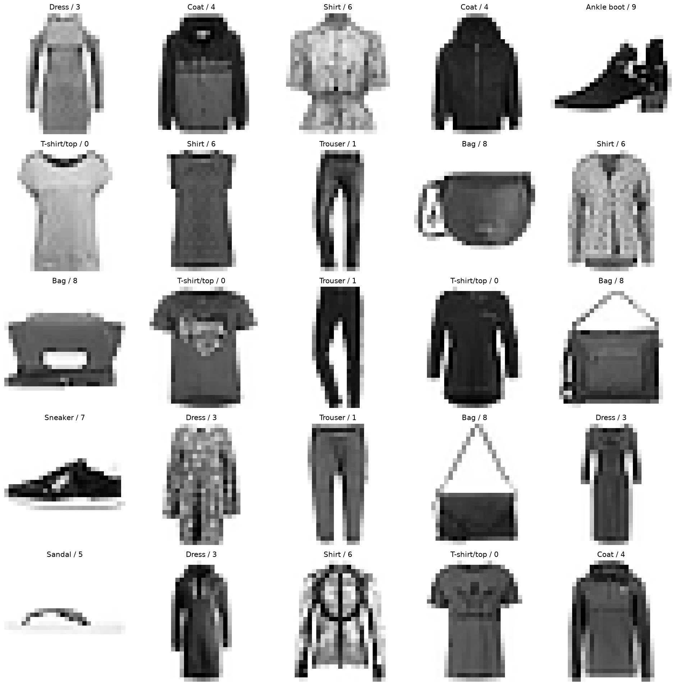
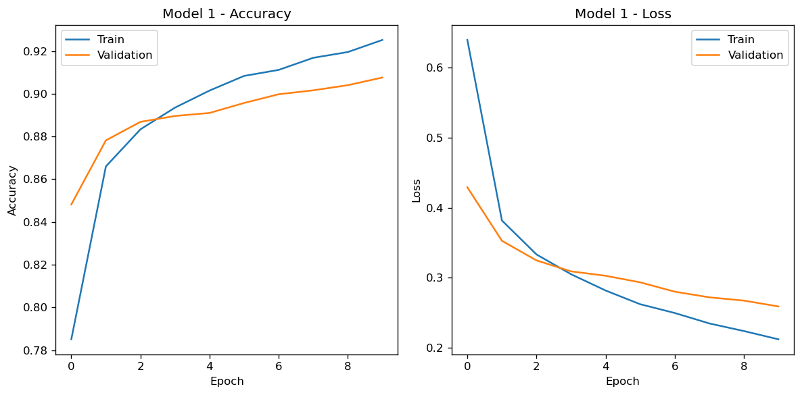
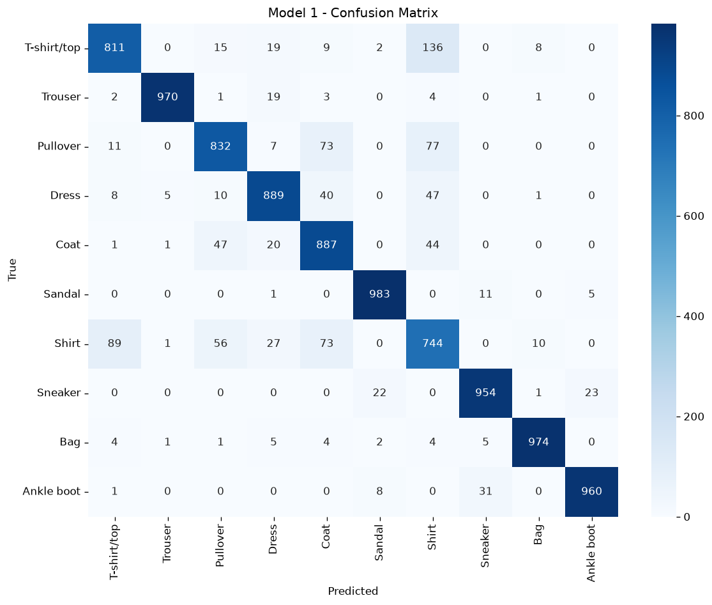
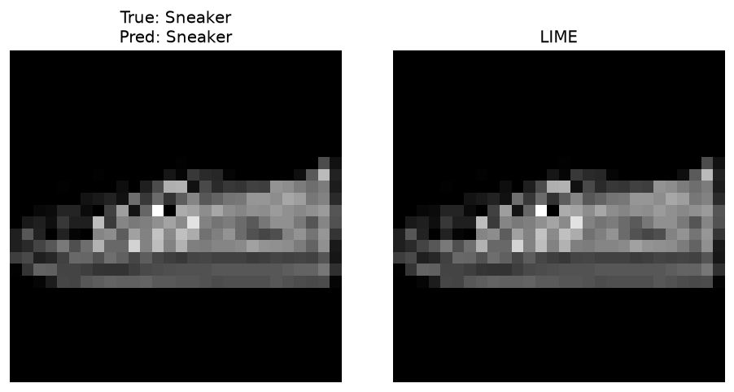
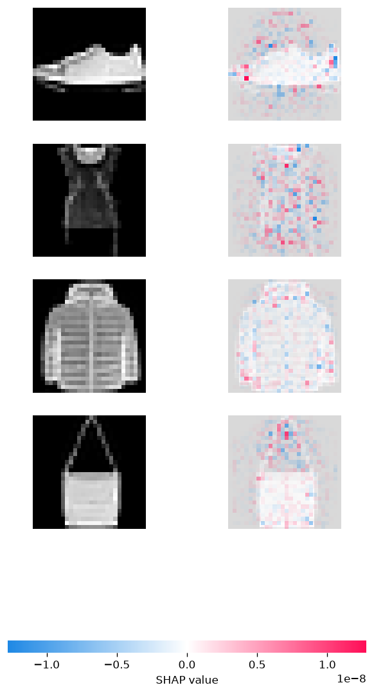
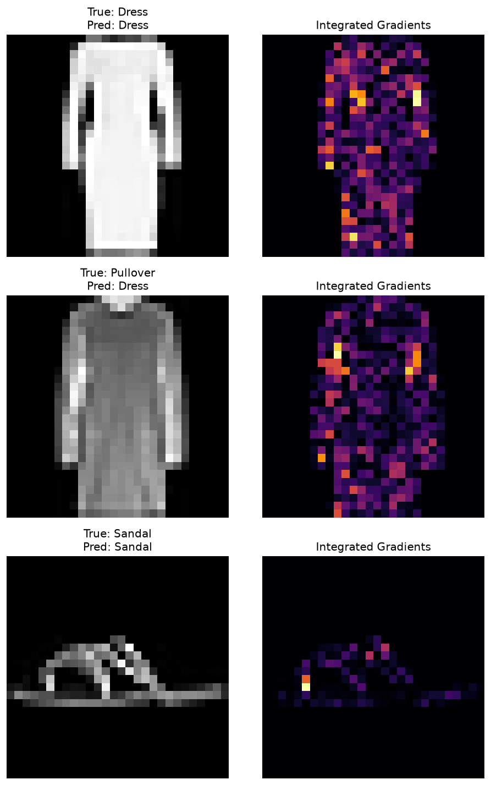
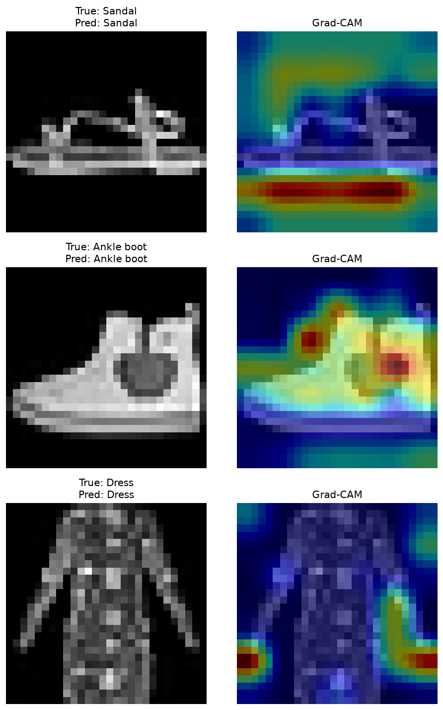

# Fashion-MNIST CNN + Explainability (LIME, SHAP, Integrated Gradients, Grad-CAM)

A CNN that classifies Fashion-MNIST clothing images into 10 categories, with four different explainability methods run against the same predictions: LIME, SHAP, Integrated Gradients, and Grad-CAM. Any one of these methods can mislead you on its own. If all four point at the same pixels for a given prediction, that's a much stronger claim about what the network is doing than a single heatmap would be.

## Dataset

[Fashion-MNIST](https://github.com/zalandoresearch/fashion-mnist), 60,000 training and 10,000 test grayscale 28x28 images across 10 clothing categories: T-shirt/top, Trouser, Pullover, Dress, Coat, Sandal, Shirt, Sneaker, Bag, Ankle boot. It loads directly through `keras.datasets.fashion_mnist`, so there's no manual download step.



## What's in the notebook

Two models get trained and compared. Model 1 is a small baseline: one conv block, one dense layer. Model 2 adds a second conv block and dropout, mainly because Model 1's errors cluster around Shirt, Pullover, Coat, and T-shirt/top, which look nearly identical at 28x28 resolution even to a person. Both models get a confusion matrix and a full precision/recall/F1 report on the test set.

After that come four explainability passes on the same predictions. LIME blanks out random patches of an image thousands of times and fits a simple linear model on the results to see which regions push the prediction one way or another; it never looks inside the network itself. SHAP treats each pixel as a player in a cooperative game and computes its Shapley value, the average effect that pixel has on the prediction across every combination of other pixels being masked. `GradientExplainer` approximates that from the model's gradients instead of brute-forcing all 784 pixel combinations, which would be impossible in practice. Integrated Gradients takes a more direct route: it walks a straight line from a black baseline image to the real image, records the gradient at each step, and averages them, so the attribution comes straight from the network's own gradients with no surrogate model and no sampling involved. Grad-CAM works differently again: it reads the activations of the model's last conv layer directly, weights the feature maps by how much each one contributed to the prediction, and produces a coarse heatmap over the image.

(An earlier version of this ran Grad-CAM through OmniXAI, a library that bundles several explainers behind one interface. It's been dropped: OmniXAI's dependency pins target an older numpy/Python combination, and installing it alongside a current TensorFlow 2.x setup sends pip into a long backtracking search that ends in a build failure on Python 3.12. The Grad-CAM implementation here is about 30 lines of TensorFlow, following the standard approach from Selvaraju et al., 2017, and doesn't have that problem.)

Trained models get saved to `models/` and reloaded automatically the next time the notebook runs, so it's not retraining from scratch every single time.

## Results

From an actual training run, Model 2, 10 epochs, batch size 512:

| Epoch | Train Accuracy | Val Accuracy | Val Loss |
|-------|----------------|--------------|----------|
| 1     | 64.6%          | 82.9%        | 0.482    |
| 5     | 88.9%          | 88.3%        | 0.338    |
| 10    | 91.1%          | 89.5%        | 0.298    |








Running the notebook again regenerates all of these into `results/`.

## Repository structure

```
.
├── Fashion_MNIST_CNN_LIME.ipynb   # data, training, evaluation, all four explainers
├── requirements.txt
├── results/                        # generated plots: curves, confusion matrix, XAI outputs
├── models/                         # saved .keras models, git-ignored
└── README.md
```

## Running it

```bash
python -m venv venv && source venv/bin/activate
pip install -r requirements.txt
jupyter notebook Fashion_MNIST_CNN_LIME.ipynb
```

Both models train fine on a laptop CPU in a few minutes. SHAP and the LIME sampling steps are the slowest part of a full run, usually a minute or two per method.

## Tech stack

Python, TensorFlow/Keras, scikit-learn, LIME, SHAP, Integrated Gradients and Grad-CAM (both implemented directly with TensorFlow's `GradientTape`, no extra library), scikit-image, seaborn, matplotlib.

## License

MIT, see [LICENSE](LICENSE).
